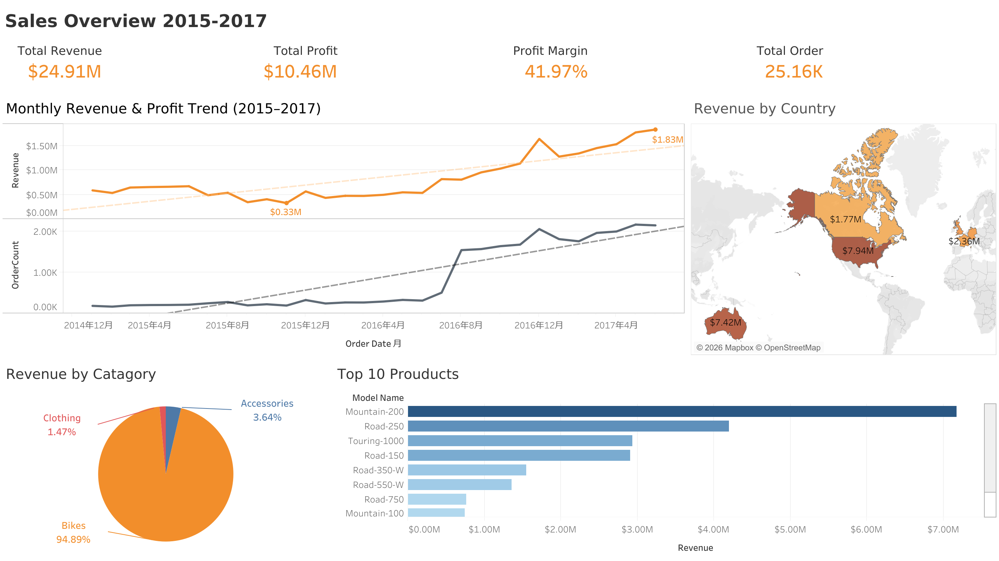

# AdventureWorks Sales Dashboard

## Project Overview

This project analyzes three years of AdventureWorks sales data to identify the main drivers of growth, product profitability, and regional performance.

The project uses MySQL to prepare and validate the data, while Tableau is used for interactive visualization and business analysis.

## Business Questions

1. Where is sales growth coming from?
2. Which products generate the most profit?
3. How does performance vary across regions?

## Key Findings

* Mountain Bikes increased their share of total sales from 15% in 2015 to 41% in 2017, making them a major driver of sales growth.
* Accessories achieved the highest profit margin at 63%, but accounted for only 3.64% of total sales.
* The overall profit margin remained highly stable across the three-year period, ranging from approximately 40% to 42%.

## Dashboard

[View the interactive dashboard on Tableau Public](https://public.tableau.com/shared/CRNG3FDQH?:display_count=n&:origin=viz_share_link)

## Dashboard Preview



## Technology Stack

* MySQL 8.x
* Tableau Desktop 2026
* SQL

## Dataset

This project uses the publicly available [AdventureWorks sample dataset](https://www.kaggle.com/datasets/ukveteran/adventure-works/data).

* 10 source tables
* 56,046 sales line-item records
* Analysis period: 2015–2017
* The 2017 dataset includes records through June only

Because 2017 contains partial-year data, year-over-year comparisons involving 2017 should be interpreted with this limitation in mind.

## SQL Architecture

All business logic is defined in the SQL layer, keeping Tableau lightweight while making analytical definitions auditable and reusable.

### Pipeline

Raw CSV files → MySQL via `LOAD DATA LOCAL INFILE` → Two analytical views → Tableau

### Views

* **`vw_product_details`**: Consolidates product, subcategory, and category information through a three-table `LEFT JOIN` chain.
* **`vw_sales_detail`**: Serves as the core analytical view, joining five tables and precomputing revenue and profit at the sales line-item level.

### SQL Techniques

Multi-table joins · `UNION ALL` · Window functions (`ROW_NUMBER`, `COUNT OVER`) · CTEs · `CASE WHEN` · String cleaning (`REPLACE`, `CAST`) · Date functions · Aggregate functions · Data-quality audit subqueries

### Data Challenges Handled

Non-UTF-8 encoding · Quoted delimiters containing embedded commas · Yearly sales partitions · Products with NULL category values · Sparse regional data

## Repository Structure

```text
adventureworks-sales-dashboard/
├── README.md
├── dashboard/
│   └── adventureworks_sales_dashboard.png
├── data/
│   └── raw/
│       └── AdventureWorks CSV files
└── sql/
    ├── 01_data_import_and_cleaning/
    │   └── import_tables.sql
    ├── 02_primary_key_checks/
    │   ├── check_primary_keys.sql
    │   └── check_duplicate_primary_keys.sql
    ├── 03_views/
    │   ├── create_product_view.sql
    │   └── create_sales_detail_view.sql
    └── 04_data_quality/
        └── check_data_quality.sql
```

## Author

Jiahe Sun
